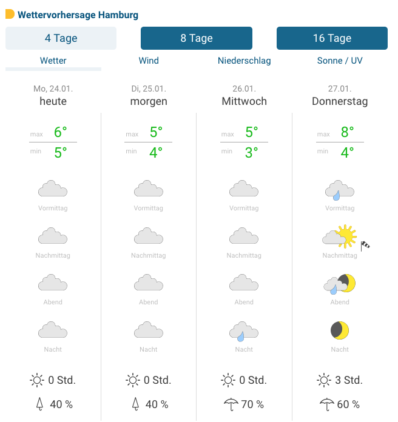

# Typescript Full-Stack Developer coding task

## Brief

The goal should be to build some weather data that shows a preview of a given city based on a weather API

You can clone this repository and create a [git bundle](https://git-scm.com/docs/git-bundle) and send it to us when you complete the task
Our focus is on the structure, the API implementation and the output

### Details:

**City JSON:** ./sample-data/germany.json

- The user should be able to select a city via a filter using the City JSON
- The list of cities is to be prepared and accessed via an api
- Based on the user selection, the weather data for the next 4 days should then be retrieved via an api call using the [Openweathermap API](http://api.openweathermap.org/data/2.5/forecast?q=hamburg&appid=a1662cb667d77b98cdd83e278af62b30)

## Design

**example could be:**

**Icons:** https://github.com/erikflowers/weather-icons/tree/master/svg

**Font:** https://fonts.google.com/specimen/Roboto?query=roboto

## Tech Stack

- Typescript
- React
- SSR (Next.js, Remix or build it yourself, see Bonus Points)
- Tailwind

## Acceptance Criteria

- Using Typescript is mandatory
- Using SSR with React is mandatory
- The app should be working and buildable with no errors

## Bonus Points
- If you want to impress us build the React SSR (with hydration) yourself without a framework
- Create a dockerfile
- Write tests!